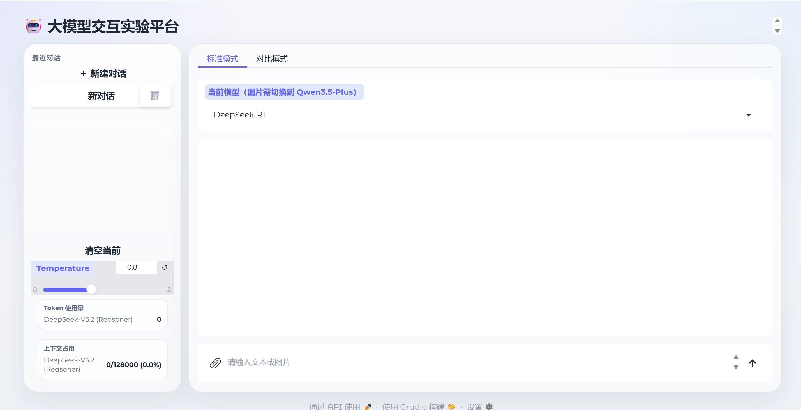

<div align="center">
  <h1>🤖 LLMChat(HCI - Lab2)</h1>
  <p>一个面向人机交互课程的现代大模型多模态对话与评测平台</p>
  
  <p>
    
    
    
    
  </p>
</div>

---

## 📖 项目简介

**LLMChat** 是为人机交互（HCI）课程实验精心打造的大语言模型可视化前端项目。本项目基于 Gradio 深度定制，不仅**完美达标并全覆盖了课程实验的所有要求**，更在 UI/UX 设计、多模态交互、多模型横向对比、上下文资源监控等方向进行了**深度的超额探索与实现**，旨在提升用户与大模型的交互效率与满意度。

**页面布局**


---

## 🎯 课程实验要求完成度 (Score: 5/5 + 附加分)

本项目严格对标并全面超越了课程考核标准：

- [x] **基础对话功能 (必选 4分)**：
  成功调用了 **两家不同公司** 的 LLM API（**DeepSeek** 与 **阿里云 Qwen**），构建了现代化的输入输出页面，支持流式 (Streaming) 极速响应。
- [x] **多轮对话功能 (可选 1分)**：
  实现了完整的上下文记忆管理机制。在同一会话下，精准拼接用户的历史对话与当前 Prompt 一同送入大模型，实现深度的多轮逻辑对话。
- [x] **历史记录功能 (可选 1分)**：
  左侧边栏内置了**会话管理系统**，支持自动记录、持久化保存（目前基于内存状态）、多路会话任意穿梭切换，随时随地继续之前的聊天。
- [x] **🚀 其他提升交互体验的高级内容 (超额完成)**：
  - **对比模式 (A/B Test)**：同屏双开模型，实时对比两家不同模型的生成质量与响应速度。
  - **多模态支持 (Vision)**：接入 Qwen-VL，支持图片上传与视觉问答，并自动向下兼容拦截不支持图片的模型。
  - **无缝打断与防崩溃**：生成过程中任意点击切换历史记录，瞬间掐断底层连接无缝跳转，绝不卡死。
  - **动态 Token 监控**：左下角毫秒级实时计算并渲染当前上下文的 Token 消耗与窗口占用百分比。

---

## ✨ 核心特性 (Core Features)


### 🔄 无缝的双工作模式
- **标准单聊模式**：沉浸式的单模型深度交互，发送即清空输入框，告别任何视觉阻滞。
- **硬核对比模式**：选择两个大模型对同一 Prompt 进行双排同步流式对比输出。在上方 Tab 切换时，系统会**自动记忆并恢复**对应模式的历史进度，互不干扰。

### ⚡ 健壮的底层与交互
- **脏数据自动清洗**：在多模态（含图片）与纯文本模型之间切换时，底层接口会自动过滤、转译不兼容的历史图片节点，防止程序崩溃。
- **Temperature 一致性保障**：底层 `model_provider.py` 自动侦测 `Temperature=0` 的极端情况，并注入 `seed=42` 参数以最大程度保证模型输出的一致性。
- **支持本地图片编解码**：彻底打通 Gradio 前端 File 对象与 OpenAI 协议的 `image_url` 之间的格式壁垒，图片上传稳如磐石。

---

## 🚀 快速开始 (Quick Start)

### 1. 环境准备
确保您的计算机上已安装 Python 3.10 或更高版本。

```bash
# 克隆项目到本地
git clone https://github.com/CCAAttking7/hci-lab2-ChatLLM.git
cd hci-lab2-ChatLLM

# 推荐使用虚拟环境
python -m venv .venv
# Windows: .venv\Scripts\activate
# Linux/Mac: source .venv/bin/activate

# 安装依赖项 (假设已配置好 requirements.txt 或使用 uv)
pip install gradio openai python-dotenv
```

### 2. 配置 API 密钥
在项目根目录创建一个 `.env` 文件，并填入您的 API Key：

```env
DEEPSEEK_API_KEY=sk-your-deepseek-api-key-here
QWEN_API_KEY=sk-your-qwen-api-key-here
```

### 3. 一键运行
```bash
python app.py
```
终端会输出一个本地服务地址（如 `http://127.0.0.1:7860`），点击即可在浏览器中体验大模型交互实验平台！

---

## 🧩 架构与技术栈 (Architecture)

本项目采用了**前端/后端解耦**的模块化设计，核心代码集中于 `llm_lab/` 目录中：

- `app.py`: 应用入口，环境初始化与服务拉起。
- `llm_lab/ui.py`: 负责 Gradio 界面组件的声明、布局拼装与交互事件 (`click`, `submit`, `select`) 的绑定。
- `llm_lab/controller.py`: 业务逻辑控制中枢，负责调度会话切换、响应流式请求和异常处理。
- `llm_lab/model_provider.py`: 大模型 API 接口底座，负责不同模型供应商的鉴权、Token 实时估算及多模态格式适配。
- `llm_lab/state.py`: 数据实体与会话状态管理，处理历史记录的增删改查。
- `llm_lab/styles.py`: 存放项目的高级自定义 CSS。

---

## 🛠️ 目前支持的模型矩阵

本项目已原生适配以下模型（可随时在 `model_provider.py` 中扩展）：

| 模型供应商 | 模型名称 | 上下文窗口 | 是否支持多模态 (Vision) | 备注 |
| :--- | :--- | :--- | :--- | :--- |
| **DeepSeek** | DeepSeek-V3.2 (Reasoner) | 128K | ❌ | 深度思考，逻辑推理极强 |
| **Qwen (Aliyun)** | Qwen3-Max (Thinking) | 262K | ❌ | 通义千问顶级纯文本旗舰 |
| **Qwen (Aliyun)** | Qwen3.5-Plus (VL/1M) | 1M | ✅ | 支持超大上下文与图片视觉问答 |

---

## 🤝 贡献与协议 (Contributing & License)

欢迎提交 Issue 和 Pull Request 来完善这个实验项目！
本项目基于 [MIT License](LICENSE) 开源。